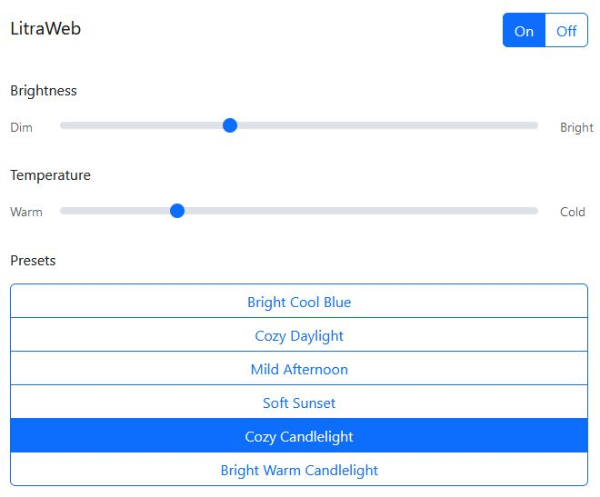

# LitraWeb
LitraWeb is a simple web interface and API for the [Logitech Litra Glow](https://www.logitech.com/products/lighting/litra-glow.html), written in Go with an HTML/JS/CSS/Bootstrap front end.

It makes use of the [derickr/go-litra-driver](https://github.com/derickr/go-litra-driver) project which offers a Go driver for the Logitech Litra Glow.

It enables the Litra Glow to be plugged into a Linux PC such as a Raspberry Pi, and the web interface accessed remotely to control the light.

In my case this is useful since I use the light for video calls, and my work laptop doesn't permit 3rd party software. You may have your own use case, and if so I hope it's more interesting than mine.

## Functionality 
LitraWeb offers the same basic set of functionality as the Go driver:
- Turning the light on/off
- Setting brightness
- Setting colour temperature

Additionally, the named presets provided by Logitech in the official software have been implemented in LitraWeb.

## Installation

For the most part, simply plug in your light, then compile and run the application. It will listen on port 8080 by default.

To run as a non-root user on Linux, you'll need to set up the following udev rule in ``/etc/udev/rules.d/82-litra-glow.rules``:

    SUBSYSTEM=="usb", ATTRS{idVendor}=="046d", ATTRS{idProduct}=="c900", MODE:="0666", GROUP="plugdev"

Then load the new rule:

    udevadm control --reload-rules && udevadm trigger

And finally, (re-)plugin your light.

## Usage
The web interface can be accessed at the root of port 8080 on your device, e.g. ``http://127.0.0.1:8080/``

The API offers the following endpoints:
| Endpoint              | Purpose             | Request | Variable Input                                                   |
|-----------------------|---------------------|---------|------------------------------------------------------------------|
| /api/on               | Turn the light on   | GET     |                                                                  |
| /api/off              | Turn the light off  | GET     |                                                                  |
| /api/brightness/:var  | Set the brightness  | GET     | :var - brightness value Range: 0-100                             |
| /api/temperature/:var | Set the temperature | GET     | :var - temperature value Range: 2700-6500 (in increments of 100) |

## Limitations
Rome wasn't built in a day, but this software was. Use it with care, and don't consider it secure or production-ready.

The following are limitations at the moment which I'd like to be able to address:
- Only a single light is supported.
- The presets are a guess based on the slider locations in Logitech's official software. If anyone finds the actual values they use then feel free to correct mine.
- It isn't possible to read the state of the Litra Glow, in order to pre-set the toggles and sliders to their current values.
- I've only tested on Linux, not sure if this will work on Windows/Mac.
- No form of API authentication.

## Pull Requests
...are very welcome. I am not a ~~Go~~ developer, just a systems guy with a light behind my webcam. Please help fix my code 😉